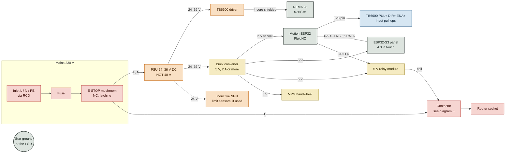
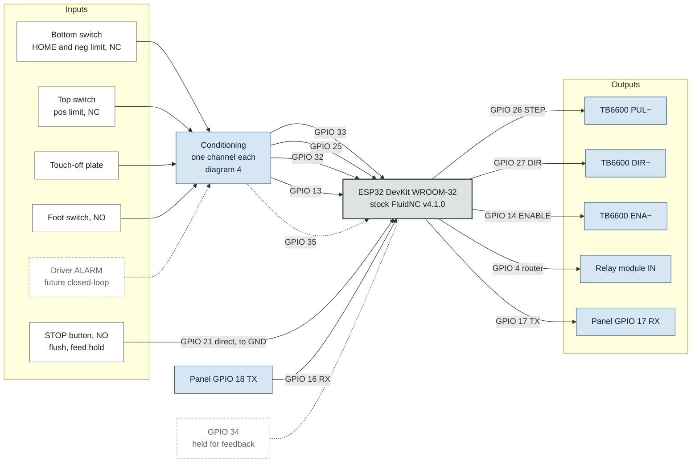
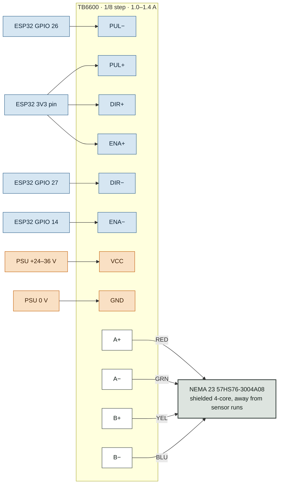
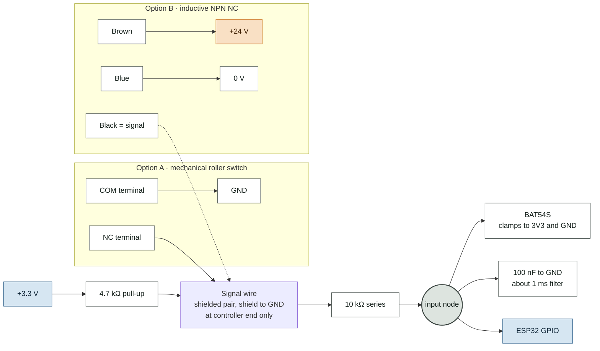
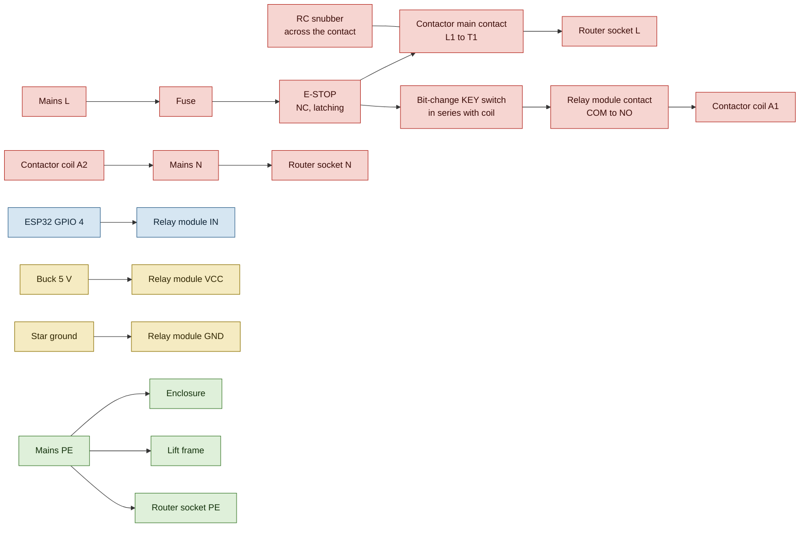
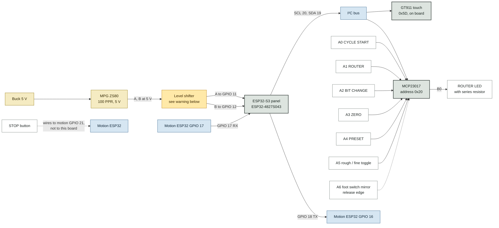

# routerLift wiring map — Rev H

Every connection in the split design: stock FluidNC on a classic ESP32 moves the lift, and an
ESP32-S3 touch panel drives it over UART. Pin numbers come from `firmware/config.yaml` (verified on
the bench, 2026-09-13) and `hmi/include/pins.h`. **If this page and those files disagree, the files
win.**

Node colours: red = mains 230 V · orange = 24–36 V DC · yellow = +5 V · blue = 3.3 V logic ·
dashed = reserved or not yet fitted.

## Before power-up

| # | Check |
| --- | --- |
| 1 | **PSU 24–36 V only.** A 48 V supply destroys the TB6600 (abs max ≈40–42 V) |
| 2 | **TB6600 PUL+ DIR+ ENA+ to 3.3 V, not 5 V.** At 5 V the input opto never turns fully off, so steps go missing without any error |
| 3 | **Inductive sensors NPN only.** `LJ12A3-4-Z/BY` is right; any `/A…` suffix is PNP and puts 24 V on the GPIO |

## 1 · Power and system overview

One PSU feeds everything low-voltage. The E-stop sits in the mains supply, ahead of both
controllers, so neither can override it. Join every 0 V at a single star point next to the PSU.

## 2 · Motion controller ESP32 — every pin

Everything that starts motion or protects the machine lands here, so it keeps working when the
panel has crashed or the UART link has dropped.

| GPIO | Signal | Goes to | FluidNC key |
| --- | --- | --- | --- |
| 26 | STEP | TB6600 PUL− | `step_pin` |
| 27 | DIR | TB6600 DIR− | `direction_pin` |
| 14 | ENABLE | TB6600 ENA− | `disable_pin` |
| 4 | Router on/off | Relay module IN | `Relay: output_pin` |
| 33 | Bottom limit, homes here | Conditioner ← switch | `limit_neg_pin` |
| 25 | Top limit | Conditioner ← switch | `limit_pos_pin` |
| 32 | Probe plate | Conditioner ← plate; croc clip on bit to GND | `probe: pin` (active low) |
| 13 | Foot switch | Conditioner ← switch to GND | `macro0_pin` (active low) |
| 21 | STOP (feed hold) | Button to GND, internal pull-up | `feed_hold_pin` (active low) |
| 17 | UART TX | Panel GPIO 17 (RX) | `uart1: txd_pin` |
| 16 | UART RX | Panel GPIO 18 (TX) | `uart1: rxd_pin` |
| 35 | Driver alarm, reserved | Conditioner, wired NC | not configured yet |
| 34 | Reserved | nothing; held for feedback hardware | — |
| 3V3 | 3.3 V out | TB6600 PUL+ DIR+ ENA+, conditioner pull-ups | — |
| VIN · GND | Power in | Buck 5 V · star ground | — |

## 3 · TB6600 driver and motor

Common-anode wiring: the + terminals share 3.3 V and the ESP32 pulls each − terminal low to switch
it. DIP switches: 1/8 microstep (1600 pulses/rev), **1.0–1.4 A per phase**.

> ⚠️ **Why 1.0–1.4 A, not the motor's 3.0 A.** The lift needs about 0.15 N·m and this motor makes
> about 2 N·m. There is no stall detection, so at full current a bad move drives the lift into its
> hard stop with more than ten times the force it needs.

## 4 · Input conditioning — one channel

Build five identical channels: HOME (33), TOP (25), PROBE (32), FOOT (13) and DRIVER ALARM (35).
The same channel takes a mechanical switch or an NPN inductive sensor with no config change.

**Reading it:** in normal use the NC contact or NPN output holds the wire at 0 V, so the GPIO reads
LOW. At the limit, or if a wire breaks, the pull-up takes it HIGH and FluidNC stops. That is why the
bare board alarmed until GPIO 33 and 25 were jumpered to GND.

**Probe and foot switch** use the same channel but are normally open: plate or pedal to the signal
wire, other side to GND. Their FluidNC pins are set `:low`, so pressing reads as active.

> ⚠️ **Pull-up placement is a drawing decision, not yet in the BOM.** The 4.7 kΩ pull-up sits on
> the sensor side of the 10 kΩ series resistor. On the GPIO side, a closed switch would only pull
> the input to about 2.2 V (a 10 k / 4.7 k divider), which may not read as LOW. Confirm on the bench.

## 5 · Mains and router switching

Three things must all agree before the router runs: the E-stop is out, the bit-change key is in,
and FluidNC has set GPIO 4 with `M3`. Only the last one is software.

> ⚠️ **Check against your parts.** This drawing assumes a **230 V AC contactor coil**. For a 24 V
> coil, feed the key switch and relay contact from the 24 V rail instead of mains L, and return A2
> to 0 V. Size the contactor at twice the router's nameplate current or more. Mains cable and
> connectors must be a different type from every low-voltage run, so they cannot be cross-plugged.

## 6 · Operator panel

The panel holds everything that depends on job state: presets, zero validity, cycles. Five buttons
and the selector go through an MCP23017 on the touch controller's I²C bus, so they cost no GPIOs.

| Panel pin | Signal | Notes |
| --- | --- | --- |
| GPIO 18 | UART TX → motion GPIO 16 | 3.3 V both ends, no shifter. Also join GND |
| GPIO 17 | UART RX ← motion GPIO 17 | 115200 baud |
| GPIO 11 · 12 | MPG A · B | Must arrive at 3.3 V |
| GPIO 20 · 19 | I²C SCL · SDA | Shared with the on-board GT911 |
| MCP A0–A5 | Buttons and selector | Dry contact to GND, internal pull-ups |
| MCP A6 | Foot switch mirror | Plan still unverified — see `firmware/README.md` |
| MCP B0 | ROUTER LED | Lit = live, blinking = warming up |
| GPIO 10 · 13 | Spare | GPIO 0 is a boot strap: never a button |

> ⚠️ **Open design issue — MPG level shifter.** `docs/BOM.md` specifies a **74HCT14**. A 74HCT14
> needs a 5 V supply, and then its outputs swing to 5 V, which can damage the S3's inputs. Use a
> **74LVC14 powered from 3.3 V** instead: 5 V-tolerant inputs, same Schmitt hysteresis, and two
> stages per channel stay non-inverting. Not yet changed in the BOM.
